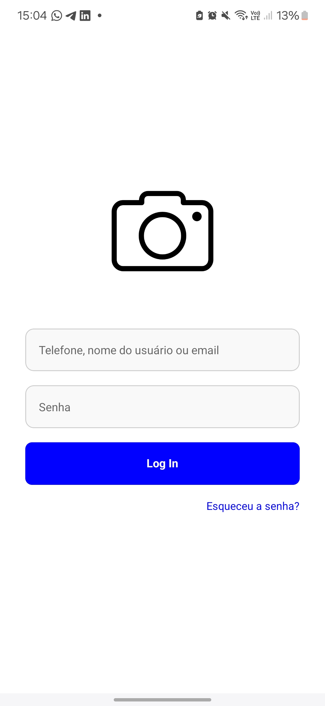

# Tela de Login - React Native



Aplicativo de tela de login desenvolvido em React Native como parte da atividade avaliativa da disciplina de Programção de APP.

## Funcionalidades

- Campo para telefone, nome de usuário ou email
- Campo de senha com mascaramento de caracteres

## Tecnologia Utilizada

- React Native

## Como Executar o Projeto

1. Clone o repositório:
```bash
git clone https://github.com/Kamila-Silvva/Tela_de_Login
```

2. Instale as dependências:
```bash
npm install
```

3. Execute o app:
```bash
expo start
```
